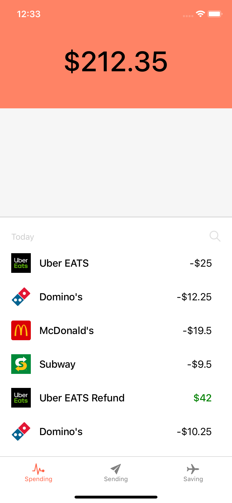

# Expo React Native

Practice using React Native with the Expo CLI

## Screens

### Spending Screen

Displays the account value and spending activity (as a series of transactions).

## External Packages

- Navigation is handled by [React Navigation](https://reactnavigation.org/en/)
- Icons are from [Ionicons](https://expo.github.io/vector-icons/)
